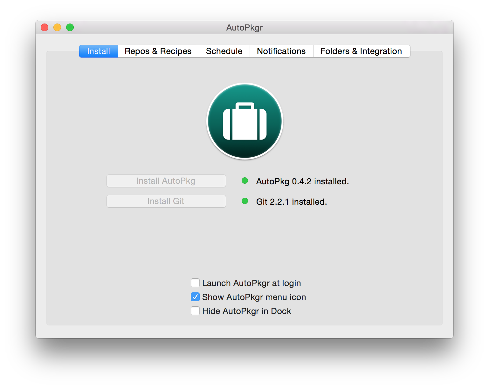
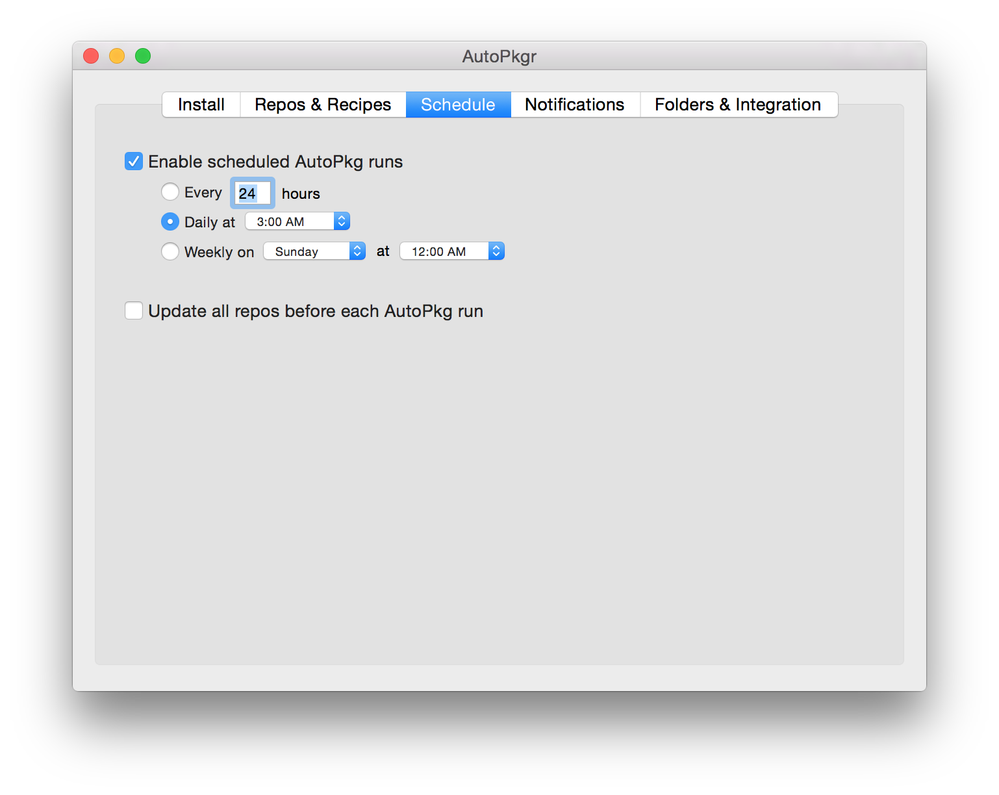
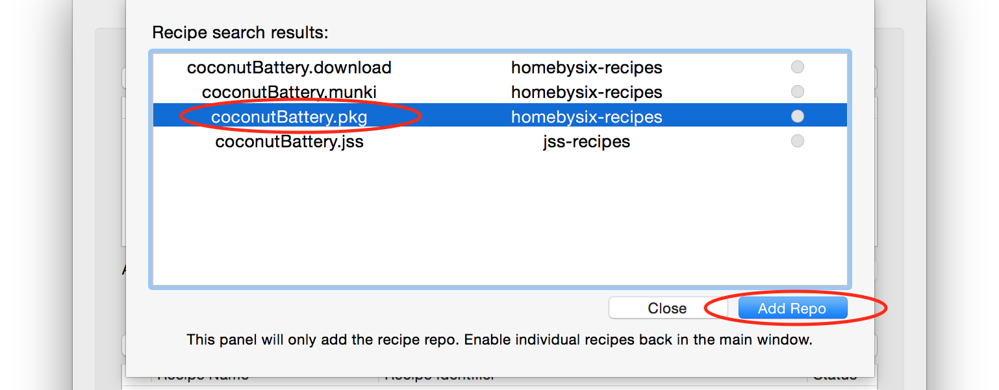
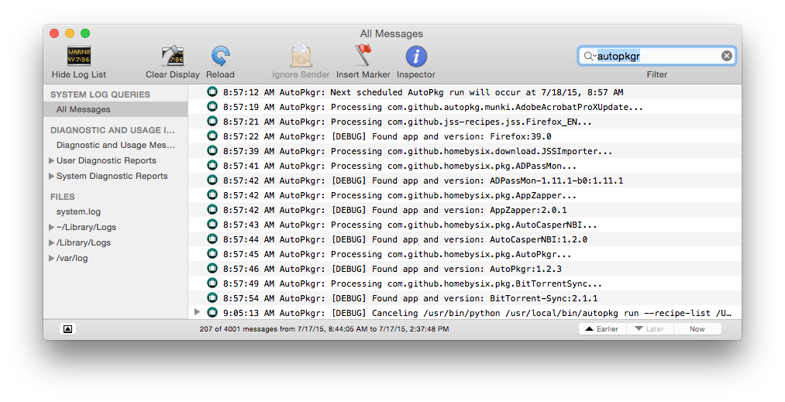

[
](https://github.com/lindegroup/autopkgr/wiki/AutoPkgr----past,-present,-and-future)

# AutoPkgr


__AutoPkgr is a free Mac app that makes it easy to install and configure [AutoPkg](https://autopkg.github.io/autopkg/).__

AutoPkg is an awesomely powerful tool for automating OS X software packaging and distribution, but it requires its users to be comfortable with command-line tools and methods. If you're not yet comfortable with the command-line, or if you just want to get AutoPkg set up from scratch quickly and reliably, AutoPkgr is for you.

To get started, download the [latest release](https://github.com/lindegroup/autopkgr/releases/latest), [install](#installation) and [configure](#basic-usage) AutoPkgr, [search for and add](#searching-for-recipes) the recipes you need, and (optionally) [integrate](integrations) AutoPkgr with your software distribution tool. If you need help, check out the [Troubleshooting](#troubleshooting) section.


<!-- MarkdownTOC autolink=true depth=3 bracket=round -->

- [Features](#features)
- [Installation](#installation)
- [Basic usage](#basic-usage)
- [Searching for recipes](#searching-for-recipes)
- [Running individual recipes](#running-individual-recipes)
- [Creating/editing recipe overrides](#creatingediting-recipe-overrides)
- [Customizing notifications](#customizing-notifications)
- [Using a proxy](#using-a-proxy)
- [Integrations](#integrations)
    - [Integration with Munki](#integration-with-munki)
    - [Integration with Jamf Pro](#integration-with-jamf-pro)
    - [Integration with HEAT LANrev](#integration-with-heat-lanrev)
    - [Integration with MacPatch](#integration-with-macpatch)
    - [Integration with FileWave](#integration-with-filewave)
    - [Integration with VirusTotalAnalyzer](#integration-with-virustotalanalyzer)
- [Troubleshooting](#troubleshooting)
- [Uninstalling](#uninstalling)
- [Credits](#credits)

<!-- /MarkdownTOC -->


## Features

AutoPkgr makes these tasks a piece of cake:

- Installation of AutoPkg itself.
- Installation of Git, which AutoPkg uses.
- Discovery of and subscription to the repositories and recipes you need.
- Automatic scheduled checks of the recipes you choose.
- Email, Slack, or HipChat notifications when new software is packaged.
- Ability to easily create and edit AutoPkg recipe overrides.
- Easy access to common folders that AutoPkg admins need.
- Basic integration of AutoPkg with popular software distribution frameworks like [Munki](https://www.munki.org/munki/), [Jamf Pro](https://www.jamf.com/products/jamf-pro/), [HEAT LANrev](https://heatsoftware.com/software-solutions/unified-endpoint-management/lanrev/), [FileWave](https://www.filewave.com/), and [MacPatch](https://macpatch.github.io/).


## Installation

AutoPkgr requires Mac OS X 10.8 or higher. If you plan on integrating with Munki, Jamf Pro, or other tools, additional requirements may apply. (See the [Integrations](#integrations) section for details.)

Download the [latest release](https://github.com/lindegroup/autopkgr/releases/latest), and drag the AutoPkgr app to your Applications folder. Then launch it.


## Basic usage

1.  Launch the AutoPkgr app.

1.  On first launch, you'll see the configuration window:

    

1.  Click the button to __Install AutoPkg__ if it's not already installed.

1.  Click the button to __Install Git__ if it's not already installed.

1.  Switch to the __Repos & Recipes__ tab.

    

1.  Select the repositories you'd like to subscribe to. We recommend adding the "default" repo to get you started:

    

    You can also add repositories manually using the "Add a repo URL manually" field.

    

1.  Select any recipes you wish to include in scheduled recipe runs.

    You can search for recipes using the "Search for a recipe on GitHub" field.

1.  Switch to the __Schedule__ tab.

    

1.  Set the schedule for automatically running recipes. Many people like to set this for once per day.

    :warning: &nbsp; Selecting "Update all repos before each AutoPkg run" exposes you to some risk, and isn't generally recommended unless you unconditionally trust the contributors to the repos you subscribe to.

1.  Switch to the __Notifications__ tab.

    

1.  Configure email, Slack, or HipChat notifications as desired.

That's it! AutoPkgr will now check for the latest app updates you specified, and when an update is available you'll receive a notification.

&nbsp;

Anytime you'd like to make changes to AutoPkgr's configuration, click on AutoPkgr's icon in the Dock, or click on the AutoPkgr icon in the menu bar (), and choose __AutoPkgr Preferences...__

You'll also find some useful shortcuts on the __Folders & Integration__ tab, which will take you directly to several convenient AutoPkg folders. On that tab, you can also configure integration with Munki, Jamf Pro, and other software deployment systems (see below).


## Searching for recipes

AutoPkgr can help you find recipes for the apps you want. In the __Recipes & Repos__ tab, enter the name of the app into the "Search for a recipe on GitHub" field, and click __Search__.


From the list of results, select your desired recipe. If the repo is not already added (as shown by the green indicator), then click __Add Repo__.



Click __Close__ to return to the recipe list. Then you should see the newly-added recipe in your available recipes list. Click the checkbox next to the recipe you want, and it will be included in future scheduled AutoPkg runs.


Don't see a recipe for an app you use? Use [Recipe Robot](https://github.com/homebysix/recipe-robot) or [write one manually](https://github.com/autopkg/autopkg/wiki/Recipe-Format)!


## Running individual recipes

If you want to run a single recipe once, simply right-click on a recipe and choose __Run This Recipe Only__.


If any recipe you're running is a .munki recipe, AutoPkgr will also run the MakeCatalogs.munki recipe. (See the [Integration with Munki](#integration-with-munki) section below for details on MakeCatalogs.munki.)


## Creating/editing recipe overrides

Recipe overrides allow you to tailor recipes' input variables to your organization's needs. __For production use, it's generally recommended to include recipe overrides instead of actual recipes.__

We've tried to simplify the process of creating and editing AutoPkg recipe overrides. Just right-click on a recipe in the list, and you'll see options for creating an override or editing an existing override.

To select which text editor to use when editing overrides, go to __Folders & Integration > Configure AutoPkg > Recipe/Override Editor__.

AutoPkgr does not currently provide a way to add trust information to existing recipe overrides, so we recommend manually using the `update-trust-info` verb in AutoPkg 1.0+ for that purpose. [You can read more about recipe trust information on the AutoPkg wiki](https://github.com/autopkg/autopkg/wiki/Autopkg-and-recipe-parent-trust-info).


## Customizing notifications

To avoid unwanted notifications, you can customize which AutoPkg events trigger a notification to be sent. To do this, go to the Notifications tab and click the __Customize...__ button next to __Choose which actions trigger notification.__

You can choose to be notified on all events, or you can select a subset of events you care about and ignore the rest.

When you're done, click __Close__.


## Using a proxy

If your network uses a proxy, you may need to navigate to the __Folders & Integration__ tab and click on the __Configure AutoPkg__ button. Adjust the proxy settings as necessary.


## Integrations

AutoPkgr makes it as easy as possible to integrate with these software distribution systems:

### Integration with Munki

:bulb: &nbsp; _Note: Requires the [Munki tools](https://www.munki.org/munki/) to be installed on the Mac running AutoPkgr._

To configure AutoPkgr to add updates directly into your Munki repository, follow these steps:

1. Click on the __Folders & Integration__ tab.
1. If Munki tools are not already installed, click on the __Install Munki tools__ button. Enter your password if prompted.
1. Click on the __Configure Munki tools...__ button, click __Choose__, and browse to your munki_repo (which can be on a mounted volume).

    

1. Click __Save and Close__.

You'll also want to make sure you have `.munki` recipes selected for each app you want to import. Once the new versions of apps appear in your Munki repo, you can add them to the appropriate catalogs and manifests to deploy them.

When you select any `.munki` recipes selected, AutoPkgr will automatically add MakeCatalogs.munki to the end of your recipe list. MakeCatalogs is a special recipe that rebuilds your Munki catalogs after any items are imported.

Since the introduction of [recipe trust information](https://github.com/autopkg/autopkg/wiki/Autopkg-and-recipe-parent-trust-info) in AutoPkg 1.0, we recommend that you create an override of MakeCatalogs instead of running the recipe itself. To do this, follow these steps:

1. Filter the recipe list for `MakeCatalogs`.
1. Right-click on the recipe shown, and choose __Create Override__.

    

That's it! You only need to create that override once. And you do _not_ need to check the box to include MakeCatalogs.munki in your schedule. It will be included automatically.


### Integration with Jamf Pro

:bulb: &nbsp; _Note: Requires Jamf Pro version 9 or newer._

(Jamf Pro was formerly known as JAMF Casper Suite.)

To configure AutoPkgr to create Self Service policies in Jamf Pro for new app updates, follow these steps:

1. Create a static computer group on your JSS called __Testing__. Add one or more test computers to the group.
1. Create an account on your JSS with __Create__, __Read__, and __Update__ access to the following objects:
    - __Categories__
    - __Computer Extension Attributes__
    - __File Share Distribution Points__ (only needs Read access)
    - __Packages__
    - __Policies__
    - __Scripts__
    - __Smart Computer Groups__
    - __Static Computer Groups__
1. Open AutoPkgr and go to the __Folders & Integration__ tab.
1. Click the __Install JSSImporter__ button. Enter your password if prompted.

    ⚠️ Note: On Macs with a fresh copy of Sierra, you may additionally need to run the following Terminal command to install the necessary components for JSSImporter:

        sudo easy_install pip && pip install -I --user pyopenssl

1. Click on __Configure JSSImporter__.
1. Enter your JSS URL, API username, and API password. Then click __Connect__.

    

1. When prompted, enter the read/write password for each distribution point.
1. Click __Save and Close__.

You'll also want to make sure you have a few `.jss` recipes selected. AutoPkgr will automatically add the "official" [jss-recipes](https://github.com/autopkg/jss-recipes) repo so you'll have a few to choose from right away.

When a `.jss` recipe runs, the package is uploaded to your distribution points, a Self Service policy is created and scoped to a new smart group. As a result, computers in the Testing group with less than the latest version of the app should now be able to install the latest version through Self Service.

For detailed information on JSS recipe behavior, check out the [README for jss-recipes](https://github.com/autopkg/jss-recipes), and for some examples of advanced workflows, see [Auto Update Magic](https://github.com/homebysix/auto-update-magic).

### Integration with HEAT LANrev

:warning: &nbsp; _LANrev integration is still in beta. We welcome [your feedback](https://github.com/lindegroup/autopkgr/issues/new)._

:warning: &nbsp; If you previously used Tom Burgin's [AbsoluteManageExport](https://github.com/tburgin/AbsoluteManageExport) processor and .absolute recipes, please see the [LANrevImporter documentation](https://github.com/jbaker10/LANrevImporter/wiki/Switching-from-AbsoluteManageExport-to-LANrevImporter) for information about how to transition to LANrevImporter.

:bulb: &nbsp; _Notes and requirements for LANrev integration:_

- _LANrev version 6.5 or newer is required._
- _The LANrev Admin app should be installed in your Applications folder._
- _Launch LANrev Admin and connect the app to your LANrev server._
- _In order to run `.lanrev` recipes, your Mac needs to be logged in and the LANrev Admin app needs to be running._

To configure AutoPkgr to add updates directly into your LANrev server, follow these steps:

1. Click on the __Folders & Integration__ tab.
1. Click on the __Install LANrevImporter__ button. Enter your password when prompted.
1. Click on the __Configure LANrevImporter...__ button. Select the __Enable External SD Package Upload__ option if desired.

    

1. Click __Save and Close__.

You'll also want to make sure you have a few `.lanrev` recipes selected. There is no official repository for LANrev recipes yet, but if you add the [seansgm-recipes](https://github.com/autopkg/seansgm-recipes) repository, you'll see a few to get you started.

### Integration with MacPatch

:warning: &nbsp; _MacPatch integration is still in beta. We welcome [your feedback](https://github.com/lindegroup/autopkgr/issues/new)._

:bulb: &nbsp; _Note: Requires you to have the default recipe repo added._


To configure AutoPkgr to add updates directly into your MacPatch server, follow these steps:

1. Click on the __Folders & Integration__ tab.
1. Click on the __Install MacPatchImporter__ button. Enter your password when prompted.
1. Click on the __Configure MacPatchImporter...__ button. Enter the URL, username, and password for your MacPatch server.

    

1. Click __Save and Close__.


### Integration with FileWave

:warning: &nbsp; _FileWave integration is still in beta. We welcome [your feedback](https://github.com/lindegroup/autopkgr/issues/new)._

:bulb: &nbsp; _Notes and requirements for FileWave integration:_

- _AutoPkg version 0.5.0 or newer is required._
- _FileWave version 10.0 or newer is required._
- _The FileWave Admin app should be installed in your Applications folder._

To configure AutoPkgr to add updates directly into your FileWave server, follow these steps:

1. Click on the __Folders & Integration__ tab.
1. Click on the __Install FileWaveImporter__ button. Enter your password when prompted.
1. Click on the __Configure FileWaveImporter...__ button.
1. Enter the hostname, port, username, and password for your FileWave server, and click __Verify__.

    

1. If verification succeeds, click __Save and Close__.


### Integration with VirusTotalAnalyzer

[VirusTotalAnalyzer](https://github.com/hjuutilainen/autopkg-virustotalanalyzer) is a processor that automatically checks downloaded packages against the VirusTotal database. AutoPkgr makes using this processor dead simple:

1. Click on the __Folders & Integration__ tab.
1. Click on the __Install VirusTotalAnalyzer__ button.
1. (Optional) Once it's finished installing, click on the __Configure VirusTotalAnalyzer__ button and adjust settings as necessary. (e.g. enter your VirusTotal API key, if you have one)

Now all downloaded files will be checked against VirusTotal's database.


## Troubleshooting

#### Step 1: Check for simple errors

- __Missing parent recipes__

    If the recipe you're trying to run has a :warning: icon next to it, the most likely problem is that its parent recipe is missing.

    

    Right-click on the recipe to view the identifier of the parent recipe.

    

    You don't need to add the parent recipe itself to your list, but you _do_ need to make sure that the repository that the parent recipe belongs to is checked in the repo list.

- __Missing or invalid recipe trust info__

    Since AutoPkg 1.0, you may be seeing warnings like this appear in your notifications:

    > WARNING: MakeCatalogs.munki is missing trust info and FAIL_RECIPES_WITHOUT_TRUST_INFO is not set. Proceeding...

    In order to prevent these errors, we recommend two things:

    - Create and use recipe overrides instead of the actual recipes themselves. See the [Creating/editing recipe overrides](#creatingediting-recipe-overrides) section for instructions on how to do this.
    - If these overrides were created before updating to AutoPkg 1.0, you'll need to use `autopkg update-trust-info` to add trust information to them. See [this page](https://github.com/autopkg/autopkg/wiki/Autopkg-and-recipe-parent-trust-info) on the AutoPkg wiki for details.

- __Out of date components__

    Quit and relaunch AutoPkgr to check for new versions of installed components, including AutoPkg, Git, and AutoPkgr itself. We recommend updating to the latest version of these tools as a first step when troubleshooting.

- __Temporarily broken recipes__

    Because software manufacturers frequently change their feeds, recipes that used to work sometimes stop working. Wait a day or so, then update your repos and try running the recipe again. Also see the troubleshooting steps [here](https://github.com/autopkg/autopkg/wiki/FAQ#this-recipe-used-to-work-but-now-it-doesnt-what-should-i-try).

- __AutoPkg is already running__

    If you get an error that says "A scheduled AutoPkg run may be running in the background," try running this command in the Terminal:

        ps ax | grep python | grep autopkg

    This should reveal the process information for active AutoPkg runs. If it's appropriate to do so, you can then terminate the process(es) by using `kill` or `killall`.

#### Step 2: Is it really AutoPkgr?

If you've eliminated the simple errors above, but AutoPkgr still doesn't do what you expect, the next step is to run your recipes directly using `autopkg` in Terminal. The following command has been helpful for us when troubleshooting. (Triple-click to select the entire line for copying.)

```
/usr/bin/python /usr/local/bin/autopkg run --recipe-list ~/Library/Application\ Support/AutoPkgr/recipe_list.txt --report-plist /tmp/autopkg-report.xml
```

If the issue repeats itself there, it's likely that the problem is with an AutoPkg recipe or repository, not with AutoPkgr. See if you can see which recipe is failing based on the output of the command above. (Information on troubleshooting individual AutoPkg recipes is [available on the AutoPkg wiki](https://github.com/autopkg/autopkg/wiki/FAQ#this-recipe-used-to-work-but-now-it-doesnt-what-should-i-try).)

For problems with email notifications, try sending an email using the same SMTP settings in another email client app.

#### Step 3: Check the logs

AutoPkgr outputs log information to the standard /var/log/system.log file.

If you've determined the issue is with AutoPkgr and not a specific recipe or repo, you may find it useful to enable AutoPkgr's verbose logging feature. To do that, click the AutoPkgr icon in the menu bar (). Then select __Verbose Logs__.

If you enable Verbose Logs for AutoPkgr, you may also want to enable the __Verbose AutoPkg Run__ option. You can find this option in __Folders & Integration > Configure AutoPkg__.

Once you've set the verbosity as desired, you'll want to view the logs.

In OS X 10.9 through 10.11, it's as simple as entering "AutoPkgr" into the filter field of the Console app:



In macOS 10.12, we recommend filtering for the "AutoPkgr" process:


If you like, you can save this filter for future reference:

1. Click the __Save__ button.

    

2. Type a name for the saved filter. Perhaps "AutoPkgr." Click __Save__.

    

3. From now on, simply click on the __AutoPkgr__ saved search in the toolbar to see AutoPkgr's log events.

    

If you prefer to view the log output in Terminal instead of Console, you could use this command in OS X 10.9 through 10.11:

    tail -f /var/log/system.log | grep "AutoPkgr"

Or this command in macOS 10.12:

    log stream --style syslog --process "AutoPkgr" --type log

Make sure to run the above commands _before_ you start AutoPkgr, because it will show you live output, not historical log entries.

#### Step 4: Reach out for help

If you're still stuck, you may want to post a message (and relevant sections of the Console logs, after removing any sensitive information) to our [Google Group](https://groups.google.com/forum/#!forum/autopkgr-discuss). And if it's a reproducible bug, please do submit an [issue](https://github.com/lindegroup/autopkgr/issues) on GitHub. We do our best to investigate bug reports and release fixes.

We also welcome feature requests on GitHub! Some of our best features have come from community suggestions.


## Uninstalling

If you decide AutoPkgr isn't for you, we've made it easy to remove. Hold down the __Option__ key while clicking the AutoPkgr icon in the menu bar (), then choose __Uninstall__.

This will remove the following files:

- __/Library/LaunchDaemons/com.lindegroup.AutoPkgr.helper.plist__
- __/Library/LaunchDaemons/com.lindegroup.AutoPkgr.schedule.plist__
- __/Library/PrivilegedHelperTools/com.lindegroup.AutoPkgr.helper__

The uninstall feature does _not_ remove the following:

- AutoPkgr preferences, stored at __~/Library/Preferences/com.lindegroup.AutoPkgr.plist__
- AutoPkgr's keychain, stored at __~/Library/Keychains/AutoPkgr.keychain-db__
- Your recipe list(s), stored at __~/Library/Application Support/AutoPkgr/recipe_list.txt__
- AutoPkg, stored in __/Library/AutoPkg__
- The AutoPkg cache, recipe repositories, and overrides, typically stored in __~/Library/AutoPkg__
- Munki tools
- JSSImporter or other integration tools

After uninstalling, you can drag the AutoPkgr app from your Applications folder to the Trash.


## Credits

AutoPkgr was created at the [Linde Group](http://www.lindegroup.com) in Emeryville, California. If you're a talented Mac admin looking for a job in the Bay Area, [check out our job listings](http://www.lindegroup.com/careers/). We've got a wonderful team of people and fantastic clients.

James Barclay, Elliot Jordan, and Josh Senick originally created AutoPkgr in June 2014, and ongoing development is led by Eldon Ahrold, Elliot Jordan, and James Barclay.

Thanks to Guillaume Gete for helping with the French localization, and to Luis Giraldo for the Spanish localization.

Briefcase icon from [FontAwesome](http://fontawesome.io/).

[](http://www.lindegroup.com/)
