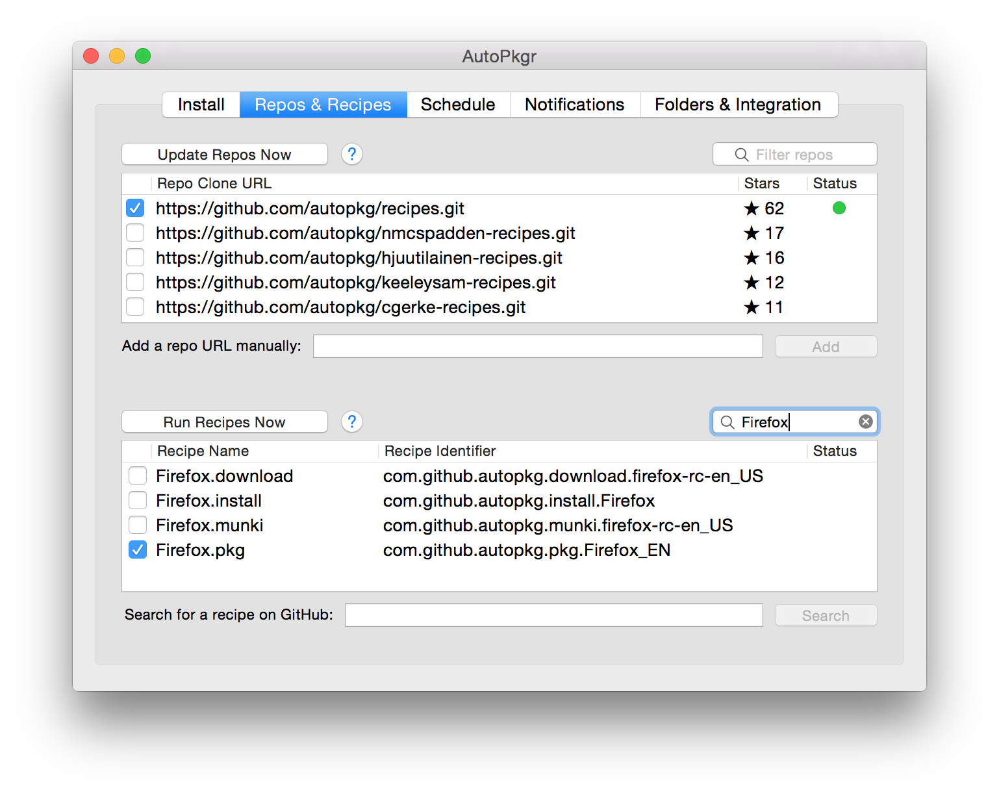

# AutoPkgr


AutoPkgr is a free Mac app that makes it easy to install and configure [AutoPkg](https://autopkg.github.io/autopkg/).

AutoPkg is an awesomely powerful tool for automating OS X software packaging and distribution, but it requires its users to be comfortable with command-line tools and methods.

If you're not yet comfortable with the command-line, or if you just want to get AutoPkg set up from scratch quickly and reliably, AutoPkgr is for you. You can find the latest release [here](https://github.com/lindegroup/autopkgr/releases/latest).


<!-- MarkdownTOC -->

- [Features](#features)
- [Installation](#installation)
- [Basic Usage](#basic-usage)
- [Searching for Recipes](#searching-for-recipes)
- [Creating/Editing Recipe Overrides](#creatingediting-recipe-overrides)
- [Integrations](#integrations)
    - [Integration with Munki](#integration-with-munki)
    - [Integration with Casper](#integration-with-casper)
    - [Integration with Absolute Manage](#integration-with-absolute-manage)
    - [Integration with MacPatch](#integration-with-macpatch)
- [Using a Proxy](#using-a-proxy)
- [Troubleshooting](#troubleshooting)
- [Credits](#credits)

<!-- /MarkdownTOC -->


## Features

AutoPkgr makes these tasks a piece of cake:

- Installation of AutoPkg itself.
- Installation of Git, which AutoPkg requires.
- Discovery of and subscription to the repositories and recipes you need.
- Ability to easily create and edit AutoPkg recipe overrides.
- Automatic scheduled checks of the recipes you choose.
- Email, Slack, or HipChat notifications when new software is packaged.
- One-click access to common folders that AutoPkg admins need.
- Basic integration of AutoPkg with popular software distribution frameworks like [Munki](https://code.google.com/p/munki/), [Casper Suite](http://www.jamfsoftware.com/products/), [Absolute Manage](https://www.absolute.com/en/products/absolute-manage), and [MacPatch](https://macpatch.github.io/).


## Installation

AutoPkgr requires Mac OS X 10.8 or higher. If you plan on integrating with Munki, Casper, or other tools, additional requirements may apply.

Download the [latest release](https://github.com/lindegroup/autopkgr/releases/latest), and drag the AutoPkgr app to your Applications folder. Then launch it.


## Basic Usage

1.  Launch the AutoPkgr app.

1.  On first launch, you'll see the configuration window:
    

1.  Click the button to __Install Git__ if needed.

1.  Click the button to __Install AutoPkg__ if needed.

1.  Switch to the __Repos & Recipes__ tab.
    

1.  Select the repositories you'd like to subscribe to. We've already added the "default" repo to get you started.

    You can also add repositories manually using the "Add a repo URL manually" field.

1.  Select any recipes you wish to subscribe to.

    You can search for recipes using the "Search for a recipe on GitHub" field.

1.  Switch to the __Schedule__ tab.
    

1.  Set your automatic update checking preferences. Most people like to check about once per day.

1.  Switch to the __Notifications__ tab.


1.  Configure email and/or Slack notifications, if desired.

1.  Click __Save and Close__.

That's it! AutoPkgr will now check for the latest app updates you specified, and when an update is available you'll receive a notification.

Anytime you'd like to make changes to AutoPkgr's configuration, just click on the AutoPkgr icon in the menu bar (), and choose __AutoPkgr Preferences...__

You'll also find some useful shortcuts on the __Folders & Integration__ tab, which will take you directly to several convenient AutoPkg folders. On that tab, you can also configure integration with various software distribution methods (see below).


## Searching for Recipes

AutoPkgr can help you find recipes for the apps you want. In the __Recipes & Repos__ tab, click the __Search for more recipes__ button. Enter the name of the app you're looking for in the search box, and type __Return__ to search.

Search results (and their corresponding repos) will be displayed below. Click the __Add__ button to add the repo, then click Done and add the recipe in the __Recipes & Repos__ tab.


## Creating/Editing Recipe Overrides

We've tried to simplify the process of creating and editing AutoPkg recipe overrides for you. Just right-click on a recipe in the list, and you'll see options for creating an override, editing an existing override, and choosing which text editor you prefer to use.


## Integrations

### Integration with Munki

To configure AutoPkgr to add updates directly into your Munki repository, follow these steps:

1. Click on the __Folders & Integration__ tab.
1. Click on the __Configure Munki tools__ button.
1. Click __Choose__, then select your munki_repo folder.

You'll also want to make sure you have `.munki` recipes selected for each app you want to import. Once the new versions of apps appear in your Munki repo, you can add them to the appropriate catalogs and manifests to deploy them.

### Integration with Casper

Note: Requires Casper version 9 or newer.

To configure AutoPkgr to create Self Service policies in Casper for new app updates, follow these steps:

1. Create a static computer group on your JSS called __Testing__. Add one or more test computers to the group.
1. Create an account on your JSS with __Create__, __Read__, and __Update__ access to the following objects:
    - __Categories__
    - __Computer Extension Attributes__
    - __File Share Distribution Points__ (only needs Read access)
    - __Packages__
    - __Policies__
    - __Scripts__
    - __Smart Computer Groups__
    - __Static Computer Groups__
1. Open AutoPkgr and go to the __Folders & Integration__ tab.
1. Click the __Install JSSImporter__ button. Enter your password when prompted.
1. Click on __Configure JSSImporter__.
1. Enter your JSS URL, API username, and API password. Then click __Connect__.
1. When prompted, enter the read/write password for each distribution point.

You'll also want to make sure you have a few `.jss` recipes selected. AutoPkgr will automatically add the "official" [jss-recipes](https://github.com/autopkg/jss-recipes) repo so you'll have a few to choose from right away.

When a `.jss` recipe runs, the package is uploaded to your distribution points, a Self Service policy is created and scoped to a new smart group. As a result, computers in the Testing group with less than the latest version of the app should now be able to install the latest version through Self Service.

For detailed information on JSS recipe behavior, check out the [README for jss-recipes](https://github.com/autopkg/jss-recipes), and for some examples of advanced worfklows, see [Auto Update Magic](https://github.com/homebysix/auto-update-magic).

### Integration with Absolute Manage

Requires Absolute Manage version ___ or newer.

To configure AutoPkgr to add updates directly into your Absolute Manage server, follow these steps:

1. one
2. two
3. three

### Integration with MacPatch

To configure AutoPkgr to add updates directly into your MacPatch server, follow these steps:

1. one
2. two
3. three


## Using a Proxy

If your network uses a proxy, you may need to navigate to the __Folders & Integration__ tab and click on the __Configure AutoPkg__ button. Adjust the proxy settings as necessary.


## Troubleshooting

__Step 1: Is it really AutoPkgr?__

If AutoPkgr doesn't do what you expect, try running your recipes directly using `autopkg` in Terminal. Specifically, the following command has been helpful for us when troubleshooting. (Triple-click to select the entire line for copying.)

```
/usr/bin/python /usr/local/bin/autopkg run --recipe-list ~/Library/Application\ Support/AutoPkgr/recipe_list.txt --report-plist /tmp/autopkg-report.xml
```

If the issue repeats itself there, it's likely that the problem is with an AutoPkg recipe or repository, not with AutoPkgr. See if you can see which recipe is failing based on the output of the command above. (Information on troubleshooting individual AutoPkg recipes is [available on the AutoPkg wiki](https://github.com/autopkg/autopkg/wiki/FAQ#this-recipe-used-to-work-but-now-it-doesnt-what-should-i-try).)

__Step 2: Check the logs__

If you've determined the issue is with AutoPkgr and not a specific recipe or repo, you may find it useful to enable AutoPkgr's verbose logging feature. To do that, click the AutoPkgr icon in the menu bar (). Then select __Verbose Logs__. The simplest way to view the logs is to filter for "AutoPkgr" in the Console app on your Mac. Sometimes the log messages illuminate the cause of the error.

__Step 3: Reach out for help__

If you're still stuck, you may want to post a message (and relevant sections of the Console logs, after removing any sensitive information) to our [Google Group](https://groups.google.com/forum/#!forum/autopkgr-discuss). And if it's a reproducible bug, please do submit an [issue](https://github.com/lindegroup/autopkgr/issues) on GitHub. We do our best to investigate bug reports and release fixes.

We also welcome feature requests on GitHub! Some of our best features have come from community suggestions.


## Credits

AutoPkgr was created by James Barclay, Elliot Jordan, and Josh Senick of the [Linde Group](http://www.lindegroup.com) with a huge amount of help from Eldon Ahrold.

We're very friendly. Stop by Emeryville sometime and have an espresso.

Briefcase icon from [FontAwesome](http://fontawesome.io/).

[](http://www.lindegroup.com/)
